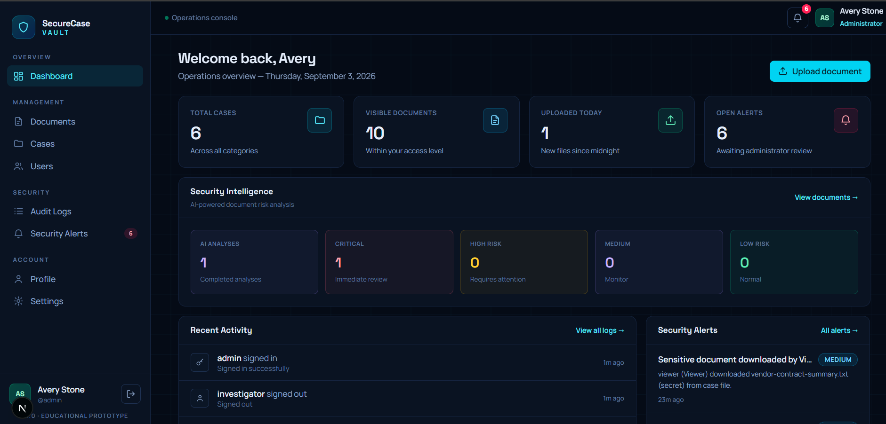

AI-Powered Secure Legal & Investigation Document Management System

A professional **cybersecurity document-management prototype** inspired by secure legal and
investigation file handling. Authorized users can upload, manage, search, view, download and
securely share sensitive case documents — with role-based access control, explicit document
sharing, a full audit trail, automatic security alerts, encryption at rest, SHA-256 integrity
verification, and AI document intelligence.

> ⚠️ **Educational portfolio prototype.** All demo data is fictitious. This project is not
> hardened against determined attackers and must not be used for real evidence, investigations
> or personal data.

---


## Feature overview

- **Dashboard** — role-aware KPIs (cases, visible documents, uploads today,
  open alerts / shared-with-me), recent activity, alert queue, recent documents.
- **Documents** — search + case/level filters, upload (PDF/DOCX/XLSX/JPG/PNG/TXT,
  10 MB cap, encrypted at rest), in-browser preview, download, share dialog,
  two-step delete, document details page.
- **Cases** — status dashboard strip (click to filter), search, create/edit,
  assigned-investigator assignment, status lifecycle
  Open → Under Investigation → Pending → Closed (Archived).
- **Users** *(admin)* — change roles, suspend/reactivate accounts.
- **Audit Logs** *(admin)* — append-only history (enforced by a database
  trigger) with search, user/action filters, date range and pagination.
- **Security Alerts** *(admin)* — rule-based monitoring (failed logins,
  unknown accounts, bulk downloads, unauthorized access, repeated denials,
  access volume, role changes, sensitive transfers) with a 14-day trend,
  totals by severity, and a New → Investigating → Resolved workflow.
- **Profile & Settings** — profile editing, password change, notification
  preferences, session info, permissions overview.

### AI Document Intelligence (prototype)

> **This AI module is a prototype and AI-generated results must be reviewed
> by an authorized human.** It does not claim legal accuracy or
> production-grade AI.

- **Text extraction** — PDF (`pdf-parse`), DOCX (`mammoth`), TXT/plain;
  image OCR is a documented future enhancement.
- **Classification** — FIR, Investigation Report, Evidence, Legal Document,
  Statement, Court Document, Other.
- **Keywords** — stopword-filtered frequency + domain-term boosting.
- **Summary** — extractive, clearly labeled.
- **Provider architecture** — `src/lib/ai/` keeps all AI logic out of routes.
  A local rule-based fallback runs by default and is labeled
  “Prototype Analysis (local rules)”. An external OpenAI-compatible API is
  used **only** when `SCV_AI_API_BASE` + `SCV_AI_API_KEY` + `SCV_AI_MODEL`
  are set in the environment (keys never hard-coded, stored, or logged).
- **Security** — only users already authorized for the document can request
  analysis; decryption is temporary and in-memory (buffer zeroed after);
  plaintext never touches disk or any URL; failures are safe and never break
  document management; every run is audited
  (`ai_analysis_requested/_completed/_failed`).

## How security works (what is actually implemented)

1. **Passwords** — bcrypt (cost 10); plain text never stored or logged.
2. **Sessions** — 256-bit random tokens in an `httpOnly` cookie, checked
   against the database on every request; 7-day expiry. Cookie attributes
   adapt to the transport (local HTTP: `SameSite=Lax`, no Secure; hosted
   HTTPS preview: `SameSite=None; Secure` + CHIPS `Partitioned` twin).
   Override for local production mode: `SCV_LOCAL_HTTP=true`.
3. **Authorization** — one permission matrix (`src/lib/auth.ts`) enforced in
   every API route and mirrored in the UI; clear 403s / “Access restricted”
   screens; 403s are audited.
4. **Visibility** — list queries are pre-filtered per role
   (`src/lib/visibility.ts`) and single-object requests re-check access.
5. **Encryption at rest** — documents are AES-256-GCM encrypted before
   storage; key from `SCV_ENCRYPTION_KEY` (or a persisted development key in
   `data/` for local use); tampered ciphertext fails authentication.
6. **Integrity** — SHA-256 of the plaintext is stored per document
   (verification fingerprint — explicitly NOT encryption).
7. **Audit logging** — append-only (DB trigger blocks UPDATE/DELETE),
   captures user, action, resource, IP, user agent, success/failure.
8. **Security monitoring** — rule-based detection over the audit log with
   deduplication; every alert raise is itself audited.
9. **AI privacy** — see the AI section; document contents are never logged.

## Project structure

```
src/
├── db/
│   ├── index.ts              # PostgreSQL connection (Drizzle)
│   └── schema.ts             # users, sessions, cases, documents,
│                             # document_shares, document_analyses,
│                             # audit_logs, security_alerts
├── lib/
│   ├── auth.ts               # sessions + role permission matrix
│   ├── bootstrap.ts          # idempotent dev initialization (demo data)
│   ├── demo-data.ts          # single source of demo content
│   ├── visibility.ts         # who-sees-what rules
│   ├── audit.ts              # append-only audit logging
│   ├── alerts.ts             # alert creation
│   ├── detection.ts          # rule-based security monitoring
│   ├── encryption.ts         # AES-256-GCM + key resolution
│   ├── files.ts              # upload validation, SHA-256
│   ├── format.ts             # labels / formatting
│   └── ai/                   # AI Document Intelligence service
├── app/
│   ├── login/ register/      # auth screens
│   ├── (app)/                # protected area
│   │   ├── dashboard/ documents/ cases/ cases/[id]/
│   │   ├── documents/[id]/ users/ audit/ alerts/ profile/ settings/
│   └── api/                  # REST endpoints (auth, cases, documents,
│                             # analyze, alerts, users, profile, health)
└── components/               # UI + interactive client components
scripts/
├── seed.mjs                  # manual demo-data seeder
└── generate-key.mjs          # generates SCV_ENCRYPTION_KEY
```

## Intentional next steps (not implemented)

- Image OCR and XLSX/PPTX text extraction for the AI module
- File storage in object storage (S3) with envelope encryption
- MFA, account lockout policies, last-admin protection
- Rate limiting, real email notification delivery, virus scanning
SecureCaseVault is a full-stack cybersecurity application designed to securely store, manage, analyze, share, and monitor sensitive legal and investigation documents.

It combines role-based access control, secure authentication, document integrity verification, audit logging, security alerts, and AI-powered document intelligence in a single platform.

## Project Highlights

- 🔐 Secure authentication with database-backed sessions
- 👥 Role-Based Access Control (RBAC)
- 📁 Secure legal and investigation document management
- 🛡️ Document integrity verification using SHA-256
- 🔒 AES-256-GCM encryption for sensitive document content
- 📋 Append-only audit logging
- 🚨 Real-time security alerts and monitoring
- 🤖 AI-powered document analysis and classification
- 🔍 Document search, filtering, preview, download, and sharing
- 📊 Security dashboard with cases, documents, alerts, and activity

## Tech Stack

### Frontend
- Next.js
- React
- TypeScript
- HTML & CSS

### Backend
- Next.js API Routes
- Node.js
- PostgreSQL
- Drizzle ORM

### Security
- bcrypt password hashing
- Secure HTTP-only sessions
- Role-Based Access Control (RBAC)
- AES-256-GCM encryption
- SHA-256 integrity verification
- Audit logging
- Security monitoring

### AI
- AI-powered document analysis
- Document classification
- Keyword extraction
- Extractive summaries
- Provider-based AI architecture
- Local rule-based fallback

## Main Features

### 📊 Security Dashboard
- Overview of cases, documents, alerts, and recent activity
- Security risk indicators
- AI analysis statistics

### 📁 Document Management
- Upload and securely store documents
- Document preview and download
- Search and filtering
- Security classification
- SHA-256 integrity verification
- Secure document sharing

### 👥 User & Access Management
- Administrator, Investigator, Legal Officer, and Viewer roles
- Role-based permissions
- Controlled access to cases and documents

### 🚨 Security Monitoring
- Security alerts for suspicious activities
- Top Secret document monitoring
- Audit trail of important user actions

### 🤖 AI Document Intelligence
- Extract text from supported documents
- Analyze document content
- Classify documents
- Extract important keywords
- Generate extractive summaries

## Security Architecture

SecureCaseVault follows a layered security approach:

```text
User
  ↓
Authentication
  ↓
Role-Based Access Control
  ↓
API Authorization
  ↓
Secure Document Storage
  ↓
Encryption + Integrity Verification
  ↓
Audit Logging & Security Monitoring

## AI-Powered Document Intelligence

SecureCaseVault uses AI to help investigators and legal teams understand documents faster.

### AI Capabilities

- 📄 Text extraction from supported PDF, DOCX, and TXT files
- 🏷️ Automatic document classification
- 🔑 Important keyword extraction
- 📝 Extractive document summaries
- 🔎 Content analysis for investigation workflows
- 🧠 Provider-based AI architecture
- ⚙️ Local rule-based fallback when an external AI provider is not configured

AI analysis is designed to assist users and does not replace human investigation or legal judgment.

## Installation & Setup

### Prerequisites

- Node.js 20+
- PostgreSQL 14+
- Git

### 1. Clone the repository

```bash
git clone <your-github-repository-url>
cd securecasevault-cybersecurity-web-application

## Demo Accounts

SecureCaseVault includes demo users for testing different access levels.

| Role | Username |
|---|---|
| Administrator | `admin` |
| Investigator | `investigator` |
| Investigator | `s.reyes` |
| Legal Officer | `legal` |
| Viewer | `viewer` |

> Demo accounts are intended only for local development and testing. Do not use demo credentials in a production deployment.

## Project Status

SecureCaseVault is a working full-stack prototype with:

- Authentication and role-based access control
- Secure document management
- Case management
- Document sharing
- AI document analysis
- Security alerts
- Audit logs
- PostgreSQL database integration
- Security testing for common web vulnerabilities

The project is designed as an educational and portfolio prototype for demonstrating secure software development and cybersecurity concepts.

## Future Enhancements

- 🔍 OCR support for image-based documents
- 📊 Advanced investigation analytics
- 🔐 Multi-factor authentication (MFA)
- 🚦 Login rate limiting and account lockout
- 🦠 Automated malware/virus scanning
- ☁️ Secure cloud object storage with envelope encryption
- 📧 Security alert notifications
- 📑 Support for additional document formats

## License

This project is developed for educational, academic, SIH, and portfolio purposes.

The demo data and credentials included in the project are fictitious and should not be used for real legal, investigation, or confidential documents.

## System Architecture

```text
                    SecureCaseVault
                          │
              ┌───────────┴───────────┐
              │                       │
           Frontend                Backend
        Next.js + React          Next.js APIs
              │                       │
              └───────────┬───────────┘
                          │
                   Authentication
                   & RBAC Security
                          │
              ┌───────────┴───────────┐
              │                       │
          PostgreSQL             File Storage
        + Drizzle ORM          + Encryption
              │                       │
              └───────────┬───────────┘
                          │
                  AI Document Engine
                          │
              ┌───────────┴───────────┐
              │                       │
        Document Analysis        Security Monitoring
              │                       │
        Classification          Alerts + Audit Logs
        Keywords + Summary

        ## GitHub

This project is maintained as an open-source portfolio project demonstrating secure full-stack development, cybersecurity, and AI-powered document management.

Repository:

```text
<your-github-repository-url>


